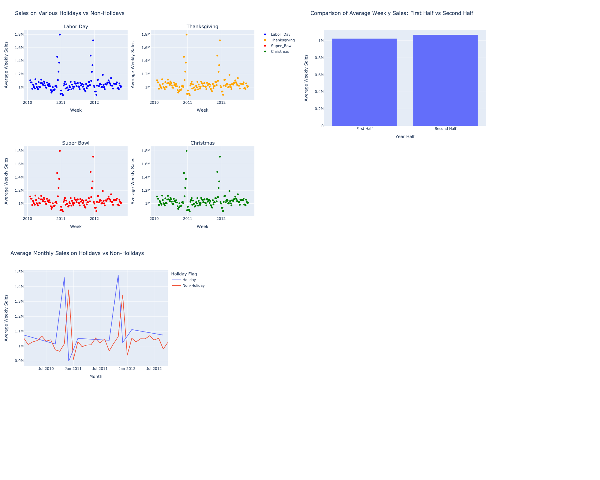

# Team #22 Project

## Team members & Roles
* Olga Ktytor - Data Analyst
* Olha Zamohylna - Data Analyst
* Sasini Munasinghe - Data Analyst
* Yevheniia Shabalova - Data Analyst

## Description
This project aims to identify relationships between weekly sales and various factors using the Walmart dataset. We will explore how the following variables impact weekly sales:

* Temperature
* CPI
* Unemployment Rate
* Fuel Price
* IsHoliday (whether the week is a special holiday week)

Our goal is to analyze these factors comprehensively and derive insights that could potentially help optimize sales strategies and operations.


## Decision-Making and Collaboration

**How will you select your dataset?** - We collectively decided to use the Walmart dataset due to its relevance to retail sales and availability of diverse variables that could impact sales performance.

**How will you make sure all team members can contribute to the project?** - we established regular syncs in our chat and also regular meetings within live sessions.

**How will you make decisions?** - Decisions are made through consensus during team meetings. We prioritize open communication and value input from all members to ensure well-informed and collaborative decisions.

**What is the question you're trying to answer through your data analysis?** - The primary question we aim to answer through our data analysis is: "What factors most significantly influence weekly sales at Walmart?"

**What tasks need to be completed to get to your final output?** - Tasks have been allocated based on our expertise. These include data cleaning, exploratory data analysis, model selection, and interpretation of results.

**What is the primary focus within the dataset?** - The primary focus within the dataset is to understand the relationships between various predictor variables (like temperature, CPI, unemployment rate, fuel price, and holidays) and weekly sales.

**What are potential relationships in the data that you could explore?** - Potential relationships we aim to explore include how changes in temperature, economic indicators (like unemployment rate and fuel price), and holiday seasons impact weekly sales.

**What are key questions your project could answer?** - 

Key questions our project aims to answer include:

1. How does temperature affect weekly sales?
2. What impact does prevailing consumer price index (CPI) have on sales performance?
3. Is there a correlation between unemployment rate and sales?
4. How do holidays influence weekly sales patterns?
5. How do fuel prices impact weekly sales?


## Rules of engagement

- Regular updates
- Deadlines
- Support and asking for help when it is needed
- Visibility (Task logging on the Board)
- Feedback

## Conclusions

**Analysis of the influence of temperature on weekly sales**

Overall, OLS regression results shows that temperature has a statistically significant but weak relationship with weekly sales.
Significance of Variables: Both the intercept and the temperature coefficient are statistically significant, as indicated by their p-values (both are < 0.05).
Effect Size: The negative coefficient for Temperature suggests that higher temperatures are associated with lower weekly sales. For each one-degree increase in Temperature, weekly sales decreases by approximately 1493 units, on average.
Model Fit: The very low R-squared value (both on training and test data) indicates that temperature explains only a very small fraction of the variance in weekly sales. This suggests that other factors not included in the model might be more important in predicting weekly sales.

### Analysis of weekly sales and Holiday_Flag

The model summary indicates that `Holiday_Flag` is not a statistically significant predictor of `Weekly_Sales`. The R-squared value is very low, suggesting that `Holiday_Flag` explains only a small portion of the variance in `Weekly_Sales`.

**Analysis of Relationship Between Weekly Sales and Fuel Prices**

From the model results, we can conclude that fuel prices do not have a statistically significant relationship with weekly sales. 
The R-squared score is very close to 0, which suggests that the independent variable does not significantly predict or explain the weekly sales based on the linear relationship we modelled. The p-value is 0.448, which is greater than the typical significance level of 0.05, so we can see that the model as a whole is not statistically significant. 
Therefore, other factors may be necessary to effectively predict weekly prices at Walmart stores.

**Analysis of Relationship Between Weekly Sales and CPI (Consumer Price Index)**
R-squared = 0.004 indicates that only 0.4% of the variance in Walmart weekly sales can be explained by changes in CPI. This suggests a very weak relationship between CPI and Walmart sales. 

CPI coefficient = (-0.0649) indicates that for every 1% increase in CPI, Walmart weekly sales are predicted to decrease by 6%.

**Analysis of Relationship Between Weekly Sales and Unemployment**
R-squared = 0.013 indicates that only 1.3% of the variance in Walmart weekly sales can be explained by the unemployment rate. This suggests a very weak relationship between unemployment and Walmart sales. 

Unemployment coefficient = (-0.1135) indicates that For every 1% increase in unemployment rate Walmart weekly sales are predicted to decrease by 11%.


## Suggestions

### Suggestions based on temperature and weekly sales correlation:

1. Exploring Additional Variables (seasonality, competitor activity, store characteristics, customer segments,  etc.)
2. Targeted Promotions: Use the insights to plan promotions and marketing campaigns more effectively. For example, if certain products sell better at specific temperatures, target promotions accordingly.
3. Inventory Management: Adjust inventory levels based on temperature forecasts to ensure adequate stock of weather-sensitive items.
4. Staffing Adjustments: Plan staffing levels according to expected sales patterns influenced by weather conditions and other factors.


### Suggestion of weekly sales and Holiday_Flag
1. Reevaluate Holiday Promotions: Since holidays do not significantly increase weekly sales, the store should reassess its promotional strategies during holidays. It might be beneficial to analyze which types of promotions (e.g., discounts, bundles) are most effective and focus on those.
2. Focus on Non-Holiday Periods: Consider boosting sales during non-holiday periods. Identify times of the year when sales are typically lower and implement targeted marketing campaigns or special events to drive traffic during these periods.

**Analysis of Relationship Between Weekly Sales and Fuel Prices**

Although, a fuel price may not directly impact sales, it could indirectly affect consumer behaviour in other ways. For instance, changes in fuel prices might influence consumer spending patterns or shopping frequency. Monitoring these behaviors could provide insights into how to adjust operations or marketing efforts accordingly.
Also, change in marketing strategies and product assortment, as well as new promotions, and customer experience improvements can help enhance sales performance.

**Analysis of Relationship Between Weekly Sales and CPI (Consumer Price Index)**

CPI plays a weak role in predicting Walmart's weekly sales. The observed effect size (-0.0649) might not warrant significant strategic changes unless coupled with other economic factors.

Inclusion of additional factors such as weather, seasons, promotions or economic indicators and performing further analysis to improve the model's explanatory power would help to make more strategic decisions regarding the effect of CPI on weekly sales.

**Analysis of Relationship Between Weekly Sales and Unemployment**
The negative relationship between unemployment and sales seems reasonable intuitively. In times of high unemployment, consumers might have less disposable income, leading to lower overall spending, potentially impacting Walmart's sales.

Though the effect of unemployment on Walmart weekly sales is statistically significant, it explains only about 1.3% of the variation in sales. This suggests that factors other than unemployment rate play a much larger role in determining Walmart sales.

Furthermore, analyzing data store wise might give better results by reducing the correlation of data within stores.


## Video recordings

## Repository
https://github.com/yevheniia-shabalova/team_project

## Link to the Board
https://github.com/users/yevheniia-shabalova/projects/1/views/1


## Links to the video recordings
- Yevheniia Shabalova https://drive.google.com/file/d/1MkZn2tzoydjEIJW_ePd6B8SM0ClSGQ9-/view?usp=sharing
- Olha Zamohylna https://drive.google.com/file/d/1aPBRQkkxkQEbIG3Cdl9PzAP0-GMu_bVv/view?usp=sharing
- Sasini Munasinghe https://drive.google.com/file/d/1w8XJJA2RDhhK_KDkfY5bkkjlYWH5qCeL/view
- Olga Ktytor https://drive.google.com/file/d/1b12ejB6CEM67kJ6zSpUs0AVkKTNE-P5Q/view?usp=share_link


# Part 2:

## Data Visualization Guiding Questions


### What are the main goals and objectives of our visualization project?

  1. To Support Decision-Making: Provide actionable information that supports decision-making processes.
  2. To Compare and Contrast: Enable comparison between different categories or time periods to identify patterns or differences.

### How can we tailor the visualization to effectively communicate with our audience?

### What type of visualization best suits our data and objectives (e.g., bar chart, scatter plot, heatmap)?

Monthly Sales Comparison: Line charts or bar charts to show trends and comparisons.
Holiday Sales Analysis: Scatter plots to show sales patterns for specific holidays.
Half-Year Comparison: Bar charts to compare average sales across different halves of the year.

### Are there any specific libraries or frameworks that are well-suited to our project requirements?

Plotly: Great for interactive and customizable visualizations. Supports a wide range of chart types.
Matplotlib: Provides detailed control over plots and is suitable for static visualizations.
Seaborn: Built on Matplotlib, it simplifies complex visualizations and improves aesthetics.

### How can we iterate on our design to address feedback and make iterative improvements?

We can collect a feedback, analyze it and then apply some changes in iterative way and the last step is to test it.

### What best practices can we follow to promote inclusivity and diversity in our visualization design?

We can achieve it by using inclusive language ensure that labels are neutral, implementing accesible color scheme, avoiding byases and providing multiple viewpoints.

### How can we ensure that our visualization accurately represents the underlying data without misleading or misinterpreting information?

### Are there any privacy concerns or sensitive information that need to be addressed in our visualization?


# Summary of the visualizations:

## Holidays variable:

- 

  **Summary**: The visualizations collectively indicate that holidays have a significant impact on sales, with notable increases in average weekly and monthly sales during holidays such as Labor Day, Thanksgiving, Super Bowl, and Christmas. The comparison of the first half and the second half of the year shows that average weekly sales are relatively consistent throughout the year. Specifically, holiday periods drive up sales sharply, as illustrated by both the dot plots and the line graph, suggesting that holidays are critical periods for increased consumer spending. This consistent pattern highlights the importance of holidays in boosting sales operations and planning marketing strategies around these times to maximize revenue.

  **Accessibility**: I used color palettes that are distinguishable for viewers - ensured that my visualizations are accessible to a wider audience. Also, labels and annotations were added to make the data comprehensive. Besides that tooltips were added to some visualizations for additional explanation.

  **Reproducibility**: I provided code that can be run and validated on someone else's machine, some comments are present to give better understanding what is happening.

  **Equity**: I used neutral and inclusive language in titles, labels, and descriptions, avoiding any terms or language that could be considered biased or exclusionary. Also, explanations and context provided that make the visualizations accessible to a wide range of viewers.


## Folder Structure

### Project 1
```markdown
|-- data
|---- processed
|---- raw
|---- sql
|-- reports
|-- src
|-- README.md
|-- .gitignore
```

### Project 2
```markdown
|-- data
|---- processed
|---- raw
|---- sql
|-- experiments
|-- models
|-- reports
|-- src
|-- README.md
|-- .gitignore
```

* **Data:** Contains the raw, processed and final data. For any data living in a database, make sure to export the tables out into the `sql` folder, so it can be used by anyone else.
* **Experiments:** A folder for experiments
* **Models:** A folder containing trained models or model predictions
* **Reports:** Generated HTML, PDF etc. of your report
* **src:** Project source code
* README: This file!
* .gitignore: Files to exclude from this folder, specified by the Technical Facilitator

