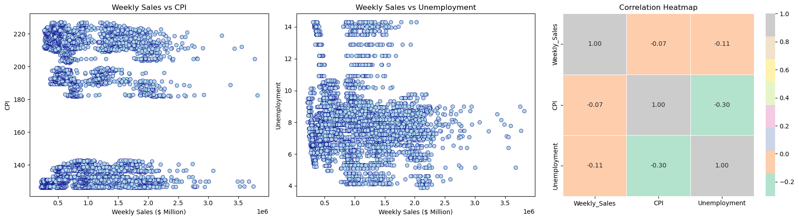
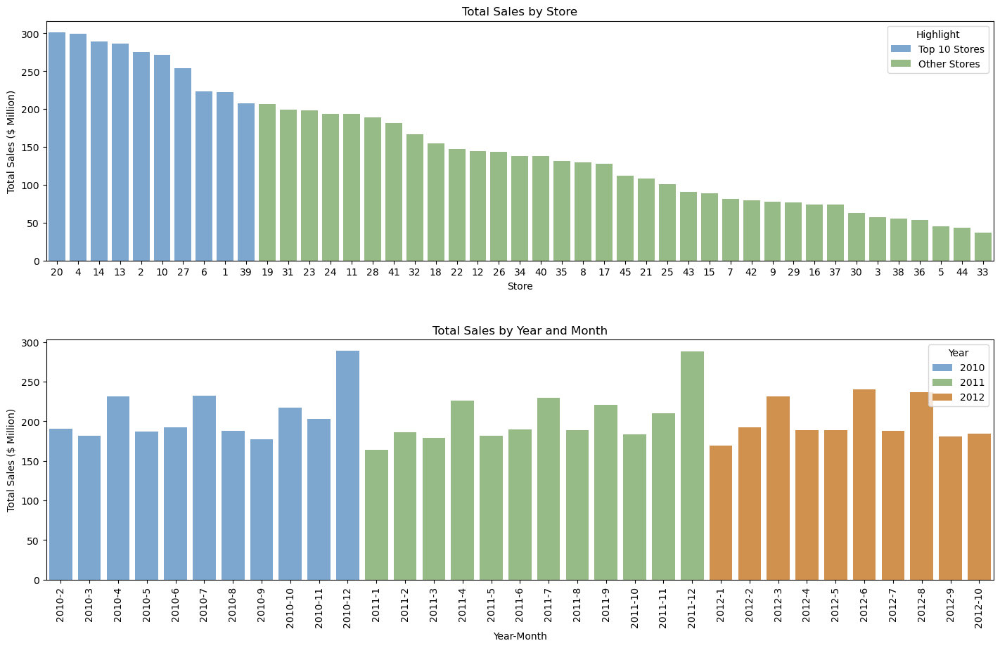
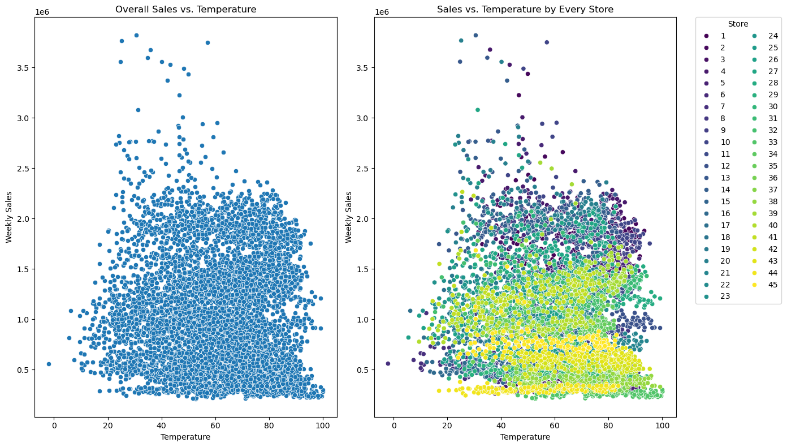
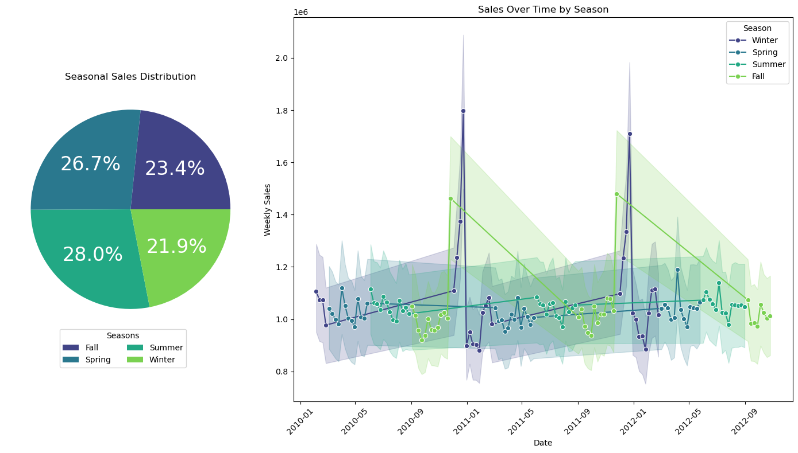
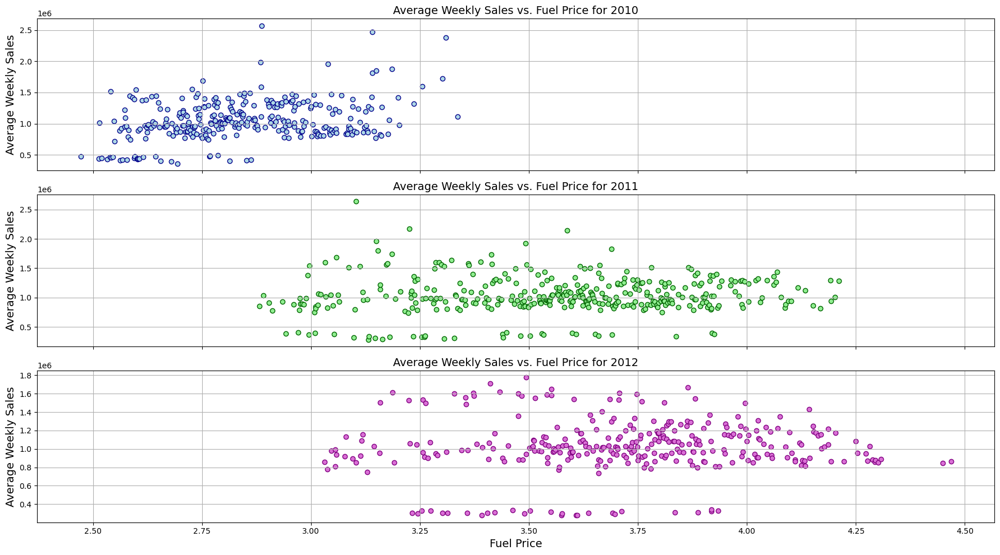
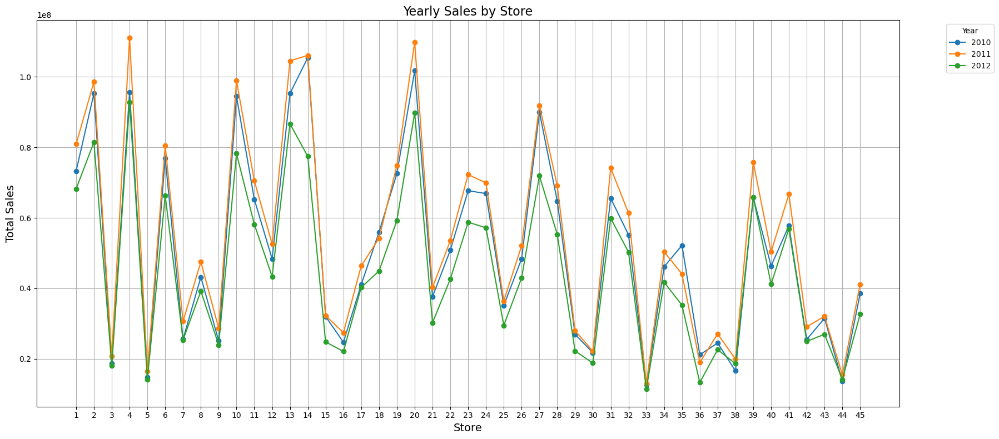
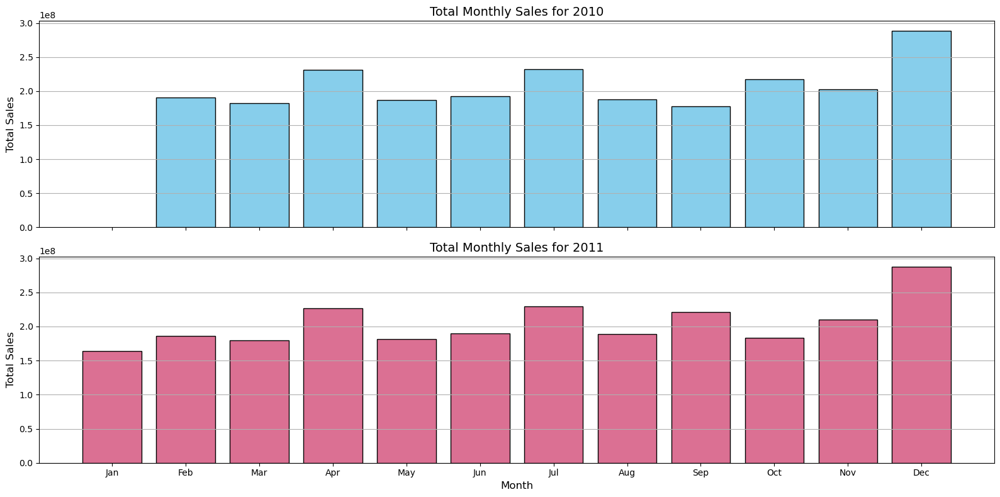

# Team #22 Project

## Team members & Roles
* Olga Ktytor - Data Analyst
* Olha Zamohylna - Data Analyst
* Sasini Munasinghe - Data Analyst
* Yevheniia Shabalova - Data Analyst

## Description
This project aims to identify relationships between weekly sales and various factors using the Walmart dataset. We will explore how the following variables impact weekly sales:

* Temperature
* CPI
* Unemployment Rate
* Fuel Price
* IsHoliday (whether the week is a special holiday week)

Our goal is to analyze these factors comprehensively and derive insights that could potentially help optimize sales strategies and operations.


## Decision-Making and Collaboration

**How will you select your dataset?** - We collectively decided to use the Walmart dataset due to its relevance to retail sales and availability of diverse variables that could impact sales performance.

**How will you make sure all team members can contribute to the project?** - we established regular syncs in our chat and also regular meetings within live sessions.

**How will you make decisions?** - Decisions are made through consensus during team meetings. We prioritize open communication and value input from all members to ensure well-informed and collaborative decisions.

**What is the question you're trying to answer through your data analysis?** - The primary question we aim to answer through our data analysis is: "What factors most significantly influence weekly sales at Walmart?"

**What tasks need to be completed to get to your final output?** - Tasks have been allocated based on our expertise. These include data cleaning, exploratory data analysis, model selection, and interpretation of results.

**What is the primary focus within the dataset?** - The primary focus within the dataset is to understand the relationships between various predictor variables (like temperature, CPI, unemployment rate, fuel price, and holidays) and weekly sales.

**What are potential relationships in the data that you could explore?** - Potential relationships we aim to explore include how changes in temperature, economic indicators (like unemployment rate and fuel price), and holiday seasons impact weekly sales.

**What are key questions your project could answer?** - 

Key questions our project aims to answer include:

1. How does temperature affect weekly sales?
2. What impact does prevailing consumer price index (CPI) have on sales performance?
3. Is there a correlation between unemployment rate and sales?
4. How do holidays influence weekly sales patterns?
5. How do fuel prices impact weekly sales?


## Rules of engagement

- Regular updates
- Deadlines
- Support and asking for help when it is needed
- Visibility (Task logging on the Board)
- Feedback

## Conclusions

**Analysis of the influence of temperature on weekly sales**

Overall, OLS regression results shows that temperature has a statistically significant but weak relationship with weekly sales.
Significance of Variables: Both the intercept and the temperature coefficient are statistically significant, as indicated by their p-values (both are < 0.05).
Effect Size: The negative coefficient for Temperature suggests that higher temperatures are associated with lower weekly sales. For each one-degree increase in Temperature, weekly sales decreases by approximately 1493 units, on average.
Model Fit: The very low R-squared value (both on training and test data) indicates that temperature explains only a very small fraction of the variance in weekly sales. This suggests that other factors not included in the model might be more important in predicting weekly sales.

### Analysis of weekly sales and Holiday_Flag

The model summary indicates that `Holiday_Flag` is not a statistically significant predictor of `Weekly_Sales`. The R-squared value is very low, suggesting that `Holiday_Flag` explains only a small portion of the variance in `Weekly_Sales`.

**Analysis of Relationship Between Weekly Sales and Fuel Prices**

From the model results, we can conclude that fuel prices do not have a statistically significant relationship with weekly sales. 
The R-squared score is very close to 0, which suggests that the independent variable does not significantly predict or explain the weekly sales based on the linear relationship we modelled. The p-value is 0.448, which is greater than the typical significance level of 0.05, so we can see that the model as a whole is not statistically significant. 
Therefore, other factors may be necessary to effectively predict weekly prices at Walmart stores.

**Analysis of Relationship Between Weekly Sales and CPI (Consumer Price Index)**
R-squared = 0.004 indicates that only 0.4% of the variance in Walmart weekly sales can be explained by changes in CPI. This suggests a very weak relationship between CPI and Walmart sales. 

CPI coefficient = (-0.0649) indicates that for every 1% increase in CPI, Walmart weekly sales are predicted to decrease by 6%.

**Analysis of Relationship Between Weekly Sales and Unemployment**
R-squared = 0.013 indicates that only 1.3% of the variance in Walmart weekly sales can be explained by the unemployment rate. This suggests a very weak relationship between unemployment and Walmart sales. 

Unemployment coefficient = (-0.1135) indicates that For every 1% increase in unemployment rate Walmart weekly sales are predicted to decrease by 11%.


## Suggestions

### Suggestions based on temperature and weekly sales correlation:

1. Exploring Additional Variables (seasonality, competitor activity, store characteristics, customer segments,  etc.)
2. Targeted Promotions: Use the insights to plan promotions and marketing campaigns more effectively. For example, if certain products sell better at specific temperatures, target promotions accordingly.
3. Inventory Management: Adjust inventory levels based on temperature forecasts to ensure adequate stock of weather-sensitive items.
4. Staffing Adjustments: Plan staffing levels according to expected sales patterns influenced by weather conditions and other factors.


### Suggestion of weekly sales and Holiday_Flag
1. Reevaluate Holiday Promotions: Since holidays do not significantly increase weekly sales, the store should reassess its promotional strategies during holidays. It might be beneficial to analyze which types of promotions (e.g., discounts, bundles) are most effective and focus on those.
2. Focus on Non-Holiday Periods: Consider boosting sales during non-holiday periods. Identify times of the year when sales are typically lower and implement targeted marketing campaigns or special events to drive traffic during these periods.

**Analysis of Relationship Between Weekly Sales and Fuel Prices**

Although, a fuel price may not directly impact sales, it could indirectly affect consumer behaviour in other ways. For instance, changes in fuel prices might influence consumer spending patterns or shopping frequency. Monitoring these behaviors could provide insights into how to adjust operations or marketing efforts accordingly.
Also, change in marketing strategies and product assortment, as well as new promotions, and customer experience improvements can help enhance sales performance.

**Analysis of Relationship Between Weekly Sales and CPI (Consumer Price Index)**

CPI plays a weak role in predicting Walmart's weekly sales. The observed effect size (-0.0649) might not warrant significant strategic changes unless coupled with other economic factors.

Inclusion of additional factors such as weather, seasons, promotions or economic indicators and performing further analysis to improve the model's explanatory power would help to make more strategic decisions regarding the effect of CPI on weekly sales.

**Analysis of Relationship Between Weekly Sales and Unemployment**
The negative relationship between unemployment and sales seems reasonable intuitively. In times of high unemployment, consumers might have less disposable income, leading to lower overall spending, potentially impacting Walmart's sales.

Though the effect of unemployment on Walmart weekly sales is statistically significant, it explains only about 1.3% of the variation in sales. This suggests that factors other than unemployment rate play a much larger role in determining Walmart sales.

Furthermore, analyzing data store wise might give better results by reducing the correlation of data within stores.


## Video recordings

## Repository
https://github.com/yevheniia-shabalova/team_project

## Link to the Board
https://github.com/users/yevheniia-shabalova/projects/1/views/1


## Links to the video recordings
- Yevheniia Shabalova https://drive.google.com/file/d/1MkZn2tzoydjEIJW_ePd6B8SM0ClSGQ9-/view?usp=sharing
- Olha Zamohylna https://drive.google.com/file/d/1aPBRQkkxkQEbIG3Cdl9PzAP0-GMu_bVv/view?usp=sharing
- Sasini Munasinghe https://drive.google.com/file/d/1w8XJJA2RDhhK_KDkfY5bkkjlYWH5qCeL/view
- Olga Ktytor https://drive.google.com/file/d/1b12ejB6CEM67kJ6zSpUs0AVkKTNE-P5Q/view?usp=share_link

## Links to the video recordings Pt. 2
- Yevheniia Shabalova https://drive.google.com/file/d/1Zu6yC5esc23ZzQqZUVhsT-mYpBAkfRDJ/view?usp=drive_link
- Sasini Munasinghe https://drive.google.com/file/d/1VlN98mRJ0chK3DzOzN54Ef29w0SEk92S/view

# Part 2:

## Data Visualization Guiding Questions

### What are the main goals and objectives of our visualization project?

  1. To Support Decision-Making: Provide actionable information that supports decision-making processes.
  2. To Compare and Contrast: Enable comparison between different categories or time periods to identify patterns or differences.

### How can we tailor the visualization to effectively communicate with our audience?

To effectively communicate with different stakeholders:

- Executives and Decision-Makers: Focus on high-level visualizations such as the pie chart and overall scatter plot to quickly convey which seasons are most profitable and general trends between temperature and sales.

- Analysts and Data Teams: Provide detailed visualizations like the scatter plot by store and time series plot. These allow for deeper insights, enabling them to identify specific stores' performance or seasonal sales peaks.

- General Audience: Ensure that the visualizations are intuitive and accessible, using clear labels, consistent color palettes, and simplified legends to make the data easy to interpret for non-experts.

### What type of visualization best suits our data and objectives (e.g., bar chart, scatter plot, heatmap)?

Monthly Sales Comparison: Line charts or bar charts to show trends and comparisons.
Holiday Sales Analysis: Scatter plots to show sales patterns for specific holidays.
Half-Year Comparison: Bar charts to compare average sales across different halves of the year.

Sales vs Temperature, Sales vs Seasons : 
Scatter Plots: Ideal for exploring correlations between sales and temperature. These plots help identify patterns or outliers and are useful for both overall trends and store-specific insights.
Pie Chart: Effective for showing the distribution of sales across different seasons, providing a clear visual summary of which seasons contribute the most to overall sales.
Time Series Plots: Essential for tracking sales trends over time, segmented by season, which helps in understanding the temporal patterns, especially around significant events like holidays.

Sales vs. Fuel Price: the scatter plot suits best to explore the relationship between these two variables.
Yearly Sales by Store: Line plot is ideal for observing how sales for each store have changed from year to year.
Total Monthly Sales: the bar plot suits best to visualize the monthly sales as it allows for clear comparisons between the two years and provides detailed insights into monthly sales trends.

Sales vs CPI/ Unemployment: Sctter plot suits best to explore the realationship between two variables. And to understand the strength of the relationship of variables correlation matrix is the best plot.
Monthly sales over the years: Line chart or clustered bar chart is best to clearly check how the monthly sales have changed over the years.
Sales by store: A bar graph sorted in descending order of the total sales suits best to easily identify the top performing stores.

### Are there any specific libraries or frameworks that are well-suited to our project requirements?

- Plotly: Great for interactive and customizable visualizations. Supports a wide range of chart types.

- Matplotlib: Provides detailed control over plots and is suitable for static visualizations.

- Seaborn: Built on Matplotlib, it simplifies complex visualizations and improves aesthetics.

### How can we iterate on our design to address feedback and make iterative improvements?

We can collect a feedback, analyze it and then apply some changes in iterative way and the last step is to test it.

### What best practices can we follow to promote inclusivity and diversity in our visualization design?

We can achieve it by using inclusive language ensure that labels are neutral, implementing accesible color scheme, avoiding byases and providing multiple viewpoints.

### How can we ensure that our visualization accurately represents the underlying data without misleading or misinterpreting information?

To maintain accuracy and avoid misinterpretation:

- Clear Labeling: Ensure that all axes, legends, and titles are clearly labeled with appropriate units and descriptions.

- Consistent Color Palettes: Using the same color palette across different visualizations helps prevent confusion and maintains a clear visual narrative.

- Avoid Overcomplicating: Simplify visualizations by avoiding unnecessary distinctions (e.g., over-segmenting data) and focusing on the most relevant comparisons.

- Transparent Data Processing: Clearly document and apply consistent methods for data processing, such as how seasons were defined or how sales were aggregated.

### Are there any privacy concerns or sensitive information that need to be addressed in our visualization?

Privacy concerns in this context could include:

- Store-Specific Data: If store IDs are linked to real locations, there could be concerns about revealing performance data that might be sensitive or proprietary.

- Aggregate Data Usage: If individual store data is aggregated without revealing specific identifiers, the risk of privacy breaches is minimized.

To address these concerns:

- Anonymization: Consider anonymizing store identifiers or grouping stores by region rather than displaying them individually.

- Aggregation: Focus on aggregate trends (e.g., seasonal or overall sales) rather than store-specific data unless necessary for the analysis.


# Summary of the visualizations:

## Holidays variable:

- 

  **Summary**: The visualizations collectively indicate that holidays have a significant impact on sales, with notable increases in average weekly and monthly sales during holidays such as Labor Day, Thanksgiving, Super Bowl, and Christmas. The comparison of the first half and the second half of the year shows that average weekly sales are relatively consistent throughout the year. Specifically, holiday periods drive up sales sharply, as illustrated by both the dot plots and the line graph, suggesting that holidays are critical periods for increased consumer spending. This consistent pattern highlights the importance of holidays in boosting sales operations and planning marketing strategies around these times to maximize revenue.

  **Accessibility**: I used color palettes that are distinguishable for viewers - ensured that my visualizations are accessible to a wider audience. Also, labels and annotations were added to make the data comprehensive. Besides that tooltips were added to some visualizations for additional explanation.

  **Reproducibility**: I provided code that can be run and validated on someone else's machine, some comments are present to give better understanding what is happening.

  **Equity**: I used neutral and inclusive language in titles, labels, and descriptions, avoiding any terms or language that could be considered biased or exclusionary. Also, explanations and context provided that make the visualizations accessible to a wide range of viewers.

## CPI and Unemployment variables/ Monthly and weekly sales trends:

- 
- 

  **Summary**: According to the scatter plots of weekly sales vs CPI/unemployment, it is clear that there is a weak relationship between these variables. This is also supported by the correlation matrix plot. The weak negative correlation between Weekly Sales and CPI/Unemployment suggests that as CPI or unemployment increases, weekly sales slightly decrease, though the relationship is not strong. The moderate negative correlation between CPI and Unemployment indicates that as the CPI increases, the unemployment rate tends to decrease moderately.

  According to the total sales by store bar graph the top 10 stores significantly outperform the others, with sales ranging from  200 to over 300 million dollars. Given that the top 10 stores contribute to more sales, Walmart could take actions to boost sales in these stores by optimizing inventory, improving customer service and by carrying out customized marketing campaigns.
  Also Walmart could analyze the issues with lower performing stores and take corrective actions, such as revisiting their product offerings, pricing strategy and promotional activities. 

  There is a noticeable increase in sales during December for both 2010 and 2011, which is likely due to holiday season. In 2012, the sales figures appear to be slightly lower compared to the previous two years. For both 2011 and 2012 lowest sales are recorded in January. Based on these sales figures Walmart could increase sales in January by carrying out early promotions. Also holiday season sales could be further improved by properly managing inventory.

  **Accessibility**: Colors used in the visualizations are not too bright and are accessible for color blind audience. 
  Contrasting colors are used to easily identify monthly and yearly sales. 
  Font size over 12pt is used to improve the readability.
  Titles, x-axis label, y-axis label and legends are included in the plots for clarity.

  **Reproducibility**: Visualizations and commented python script is available in a public GitHub repository. 
  Data set used to generate the visualizations is also included in the repository.

  **Equity**: Anyone can access this visualization publicly via Github. 
  And explanations of the visualizations are provided in Readme file making them accessible to a larger audience.
  Neutral language is used through out this project. 

## Sales vs Temperature, Sales vs Seasons




  **Summary**.
  These visualizations provide insights into the relationship between sales and temperature across different stores and seasons. 

  - Overall Sales vs. Temperature:
  This plot shows a minimal overall correlation between temperature and weekly sales. However, there are noticeable high sales during moderate temperatures, suggesting that extreme weather (either too cold or too hot) might deter shopping activities. This trend implies that consumers prefer shopping during comfortable weather conditions.
  
  - Sales vs. Temperature by Store:
  The scatter plot with distinctions by store reveals that sales behavior varies across different stores. Some stores show a strong correlation between temperature and sales, while others do not. This suggests that external factors like store location, local climate, and perhaps the type of products sold could influence how temperature impacts sales. A deeper analysis considering the geographical locations of these stores could uncover more nuanced insights into why temperature affects some stores more than others.
  
  - Seasonal Sales Distribution
  The Seasonal Sales Distribution pie chart indicates that spring and summer are the most profitable seasons, contributing the highest proportions of total sales. This could be due to increased consumer activity during these warmer months, possibly related to seasonal events, holidays, or vacation periods.
  
  - Sales Over Time by Season
  The Sales Over Time by Season time series plot highlights significant sales peaks right before January each year, indicating that the Christmas season is a particularly busy time for sales. This aligns with typical consumer behavior, where holiday shopping drives significant retail activity. The seasonal breakdown also allows for the observation of how sales fluctuate across different times of the year, reinforcing the importance of seasonality in sales planning and forecasting.

  **Accessibility**. 
  These visualizations are designed with accessibility in mind by:

  - Readable Text: The font sizes for labels, titles, and legends have been appropriately adjusted, making them readable even for those with visual impairments.

  - Color Palette: A color palette (viridis) that is accessible to color-blind users has been used, ensuring that the visual distinctions between different stores and seasons are clear to all viewers.

  - Legends: Legends are positioned thoughtfully to avoid cluttering the plots and are clearly labeled, which helps users easily identify what each color represents.

  **Reproducibility**.
  The visualizations are built in a way that they can be easily reproduced:

  - Code Reusability: The Python code provided is straightforward and can be reused or adapted for similar datasets with minimal modifications.

  - Random Seed: The random number generator is seeded (np.random.seed(13)) to ensure that any random aspects of the visualization (if they were present) are consistent across different runs.

  - Data Processing: The steps for converting dates, calculating seasons, and aggregating data are clearly outlined, allowing for easy replication in other environments or with different data.

  **Equity**.
  The visualizations attempt to provide an equitable view of the data:

  - Equal Representation: Each store and season is given equal weight in the analysis, ensuring that insights are not skewed by overemphasizing certain data points.

  - Comprehensive Analysis: By including both overall and store-specific analyses, the visualizations cater to multiple perspectives, helping various stakeholders see data that is most relevant to their interests.

## Weekly Sales vs Fuel Price/ Yearly and Monthly Sale Trends





**Summary**:
The Average Weekly Sales vs. Fuel Price visualisation shows that there is no relationship between these two variables. There is a minimal corralation and overall weekly sales are not affected by fuel prices.
The Yearly Sales by Store line plot shows how sales for different stores evolved over the years 2010, 2011, and 2012. Based on sales performance, change in marketing strategies and product assortment can be implemented to help enhance sales performance at each store.
The Total Monthly Sales plot shows monthly sales data for years 2010 and 2011. The best performing months are December, April, July and September, which is likely due to holidays or seasonal events. Monitoring these trends could provide insights into how to adjust operations and marketing efforts to increase sales.

**Accessibility**: Colours used are not bright to make the plots accessible to people with visual impairments. I added clear labels and titles to help understand what each visualisation represents. I made sure that the text is large enough and is in a readable font. Also, grid lines were added to aid in readability.

**Reproducibility**: The data set used for this project is available in the repository. To ensure that my data visualizations are reproducible, a document with the code is provided. 

**Equity**: I avoided any terms or language that could be considered biased or exclusionary. Also, the visualizations are presented in a way that is easily understood by all stakeholders, regardless of their familiarity with the data.

## Folder Structure

### Project 1
```markdown
|-- data
|---- processed
|---- raw
|---- sql
|-- reports
|-- src
|-- README.md
|-- .gitignore
```

### Project 2
```markdown
|-- data
|---- processed
|---- raw
|---- sql
|-- experiments
|-- models
|-- reports
|-- src
|-- README.md
|-- .gitignore
```

* **Data:** Contains the raw, processed and final data. For any data living in a database, make sure to export the tables out into the `sql` folder, so it can be used by anyone else.
* **Experiments:** A folder for experiments
* **Models:** A folder containing trained models or model predictions
* **Reports:** Generated HTML, PDF etc. of your report
* **src:** Project source code
* README: This file!
* .gitignore: Files to exclude from this folder, specified by the Technical Facilitator

